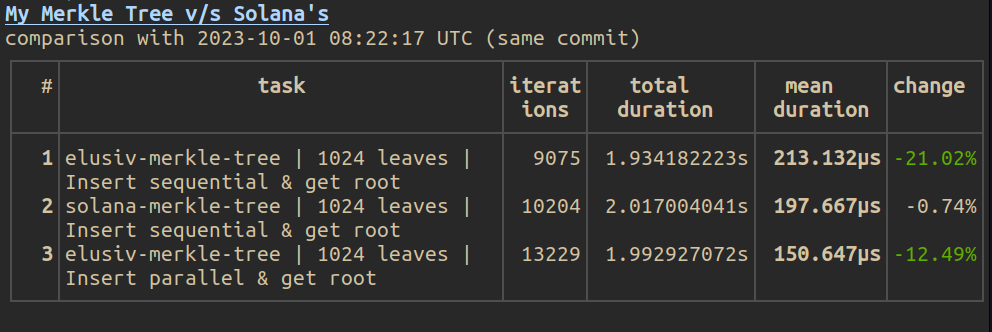
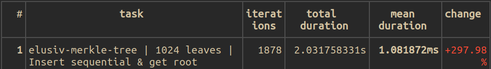
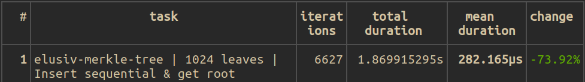

# Elusiv Merkle Tree Assignment


## Algorithm

## Benchmarks

## Optimizations & Readability
Often there are certain tradeoffs between optimizing code to be
the most efficient and having code that's readable and maintainable.
I try to have all three but it's always we can have that. Readability
is also a subjective thing but there's a difference between code that is
a subjective preference and code that is generally considered awful.(like putting everything in one lib.rs or over abstraction).

### Algorithmic Improvements
1. Since the leaves are pre-filled with defaults, when inserting we can't simply push the hash of the data so the naive approach is to loop until you find a default value and replace it. However this is O(n!) so instead I made the tree to save the current index it should add the leaf at and this helps keep track of which index to replace the leaf. This makes the efficiency closer to O(1) and resulted in a mean time ~800 micro secs faster.

    <figure>
    
    <figcaption>Before</figcaption>
    </figure>
    <figure>
    
    <figcaption>After</figcaption>
    </figure>
    <br/>
2. Pre-allocating vectors since we know the capacity of the tree also saves unnessary allocations
in the heap saving us from overhead of making syscalls(due to context switching). 

3. Values like DEFAULT_LEAF are constants saving us the time required to hash them at runtime.

### Concurrency Improvements
1. As we saw in the benchmark, instead of inserting leaves sequentially we can use multiple threads to hash the leaves and then append to the array at once saving about approx 70 - 80 micro secs.

2. Even when prefilling the tree, since the vec was already allocated we could have used `par_extend` to pre-fill in parallel but the performance improvement was negligible and I preferred the simplicity of the for loop.
### Readability Tradeoffs
1. When calculating the level length or height of the tree we have the choice between using floating point calculations like this:
    ```rs
    (current_level_len as f64 / 2.0).ceil() as usize
    ```
    or integer arithmatic like this:
    ```rs
    if current_level_len % 2 == 0 {
        current_level_len / 2
    } else {
        (current_level_len + 1) / 2
    }
    ```

    While floating point calculations do require a bit more compute, the performance
    difference in our specific use case (especially when tree h <= 10) is
    marginal. Therefore I personally feel since we are also returning a `usize` it's better
    to rely on the second option.

## Future Performance Improvements
1. AVX-512 Accelarated SHA256 - There are a few crates that do this.
2. Custom Heap Allocator - We can make a custom allocator that allocs a single dram page and then every time we need to allocate to the heap for Vecs etc we can use the custom alloc to do that. This would save the extra overhead of making syscalls into the kernal. The [Hoard Allocator](https://www.cs.utexas.edu/users/mckinley/papers/asplos-2000.pdf) has this kind of functionality.
3. Vectorize - Instead of having multiple variables to store various values we could use a single matrix/vector for the same. This would come at the cost of readability.